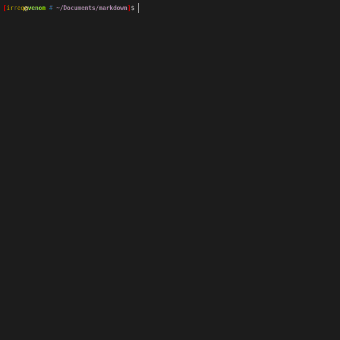
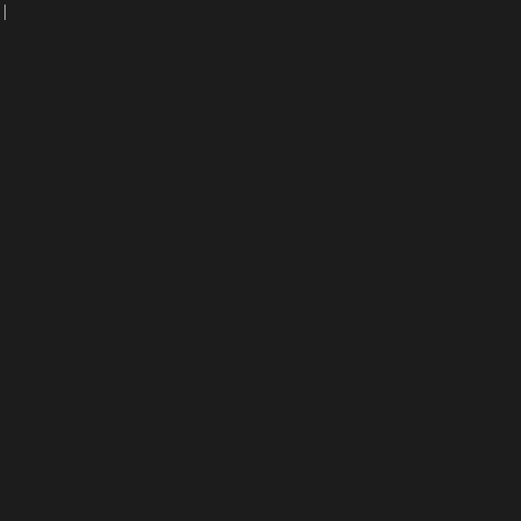

# Typingstat
This repository contains two parts, a simple C typingstat program (main) that
tries to compute your WPM and relative error as you type. The repository also
contains a python module (legacy) to measure your typing as you type. The information about your typing can be accessed by a another python module or displayed by `demos/viewer.py` in real-time*.

\* (Close to real time, as it buffers the data)

<!--  -->




* Only supports Linux at the moment!

The program does *not* grab your keyboard, but reads the input directly from the character device in `/dev/input/`. Therefore it can be open beside a document for you to get information about how you type.

## Security Concerns
A *keylogger* is used to capture typing which require `root privilegies` to run and a `UDP` server is used to communicate with the program. If not used properly it ***allows a remote third party to log information about the typing on the users machine***. However this require that the user *specifically* enable the server to output on other `ip` than `localhost`. That's why the service is as safe as the end user makes it.

Please read `NOTICE` for more information.

## Installation

Clone the project:

```
git clone https://github.com/Irreq/typingstat.git
```

Move to the project folder:

```
cd typingstat
```

Install dependencies:

```
pip3 install requirements.txt
```

Install the program and daemon:

```
sudo ./install.sh
```

Install the Python package:

```
sudo python3 setup.py install
```


## Setup

The tool might not work right after you have cloned it follow these steps below to make it work.

### Keyboard Layout

This tool was made to fit the `sv-latin1` keymap (*Swedish QWERTY-keyboard*). In order to get correct information from the program, modify `~/.config/typingstat/config.py` to fit your keyboard like:
```py
# ~/.config/typingstat/config.py
keyboard_layout = {
    1: "Esc",
    2: "1",
    3: "2",
    4: "3",
    5: "4",
    6: "5",
    # ...
    30: "A",
    31: "S",
    32: "D",
    33: "F",
    34: "G",
    35: "H",
    36: "J",
    37: "K",
    38: "L",
    # ...
    125: "Left Super",
    126: "Right Super",
    127: "Menu"
}

```
If you do not know your keyboard's specific, `id` to `key`, try running the program and map the keyboard manually as you press your keys.

### Keyboard Event

This tool can only monitor one keyboard at the time, and if you do not specify the full path to the keyboard event, it will use the first keyboard it can find.
Which if you have a laptop with a connected keyboard might not be ideal. This will hopefully be improved in the future. The default configuration file looks like this:
```py
# ~/.config/typingstat/config.py
event = None
```

In order to use the correct keyboard event, use the command `ls /dev/input/by-id` and find the keyboard that you wanna monitor, eg. `/dev/input/by-id/usb-CHICONY_Compaq_USB_Keyboard-event-kbd`. Edit the config file `~/.config/typingstat/config.py` like:

```py
# ~/.config/typingstat/config.py
event = "/dev/input/by-id/usb-CHICONY_Compaq_USB_Keyboard-event-kbd"
```


## Usage
The module consists of two parts, a daemon (*typingstatd*) and the main module (*typingstat*), notice the +d in the daemon.

### Daemon
Manually start the typingstatd daemon (requires root)
```
sudo nohup /path/to/typingstatd &
```
You can find the process and its process id (PID) with this command:
```
ps ax | grep typingstatd
```
If you want to stop the execution, you can kill it with the kill command:
```
kill <PID>
```


## Demo Program
You can run the demo script `demos/viewer.py` with the following command.
```
python3 demos/viewer.py
```

## Main Module
You can also import the `typingstat` module to your script:
```py
# Import the module
from typingstat import Typingstat
# Initiate the class
ts = Typingstat()
# Retrieve information
result = ts.poll()
# Output the result: dict() or None
print(result)
# {'kps': 3, 'wpm': 30, 'error': 3, 'strokes': 69}
```


## Contributing

### Want to Help?

All help is appreciated.
