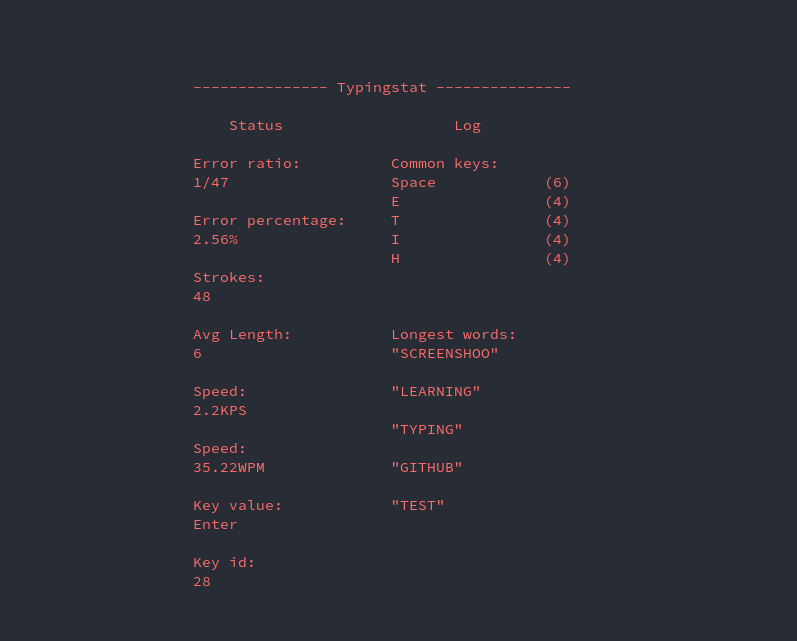

# typingstat
A tool to display your system wide typing statistics in real-time.



* Only *NIX support at the moment


## Installation

Clone the project:

```
git clone https://github.com/Irreq/typingstat.git
```

Move to the project folder:

```
cd typingstat
```

Install dependencies:

```
pip3 install requirements.txt
```


## Setup

The tool might not work right after you have cloned it follow these steps below to make it work.

### Layout

This tool was made to fit the `swedish` QWERTY-keyboard. In order to get correct information from the program, simply edit: `typingstat/layout.py` to fit your keyboard. If you do not know your keyboard's specific, `key` to `id`, try running the program and map the keyboard manually as you press your keys.

### Auto-run

Edit: `setup.ini` to your needs if you prefer to start the program without sending flags.


## Usage

***WARNING***
This tool is built around a keylogger, if you run with the flag `-l True` it will display what it thinks are typed words, including passwords. In order to access `/dev/input/`, the program needs root privileges to run.

```
sudo python3 typingstat
```

If you like green text:

```
sudo python3 typingstat -c green
```

## Contributing

### Want to Help?

All help is appreciated.
